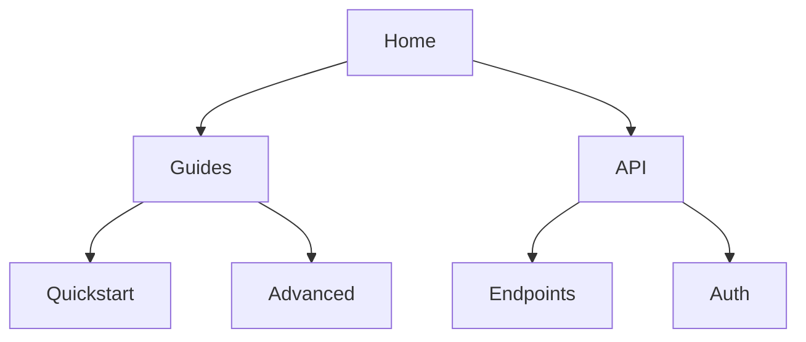

## Overview

Anil Kumar provides powerful tools to streamline your documentation workflow. You organize content hierarchically, collaborate with teams, search efficiently, and share outputs seamlessly. These features help you maintain structured, accessible project docs.

<Columns cols={2}>
  <Card title="Document Hierarchies" icon="layout" href="#document-organization">
    Build nested structures for intuitive navigation.
  </Card>
  <Card title="Team Collaboration" icon="users" href="#collaboration">
    Real-time editing and version control.
  </Card>
  <Card title="Advanced Search" icon="search" href="#search">
    Filter and find content instantly.
  </Card>
  <Card title="Export Options" icon="download" href="#export">
    Share in multiple formats.
  </Card>
</Columns>

## Document Organization and Hierarchies

Create nested document structures to reflect your project's architecture. You define pages, subpages, and sidebars for clear navigation.

<Steps>
  <Step title="Create a Page" icon="plus">
    Navigate to your workspace and select **New Page**.

    ```markdown
    # My Project Docs
    Welcome to the documentation.
    ```
  </Step>
  <Step title="Nest Subpages" icon="folder">
    Drag pages into folders or use YAML frontmatter for hierarchy.

    <CodeGroup tabs="YAML,JSON">
    ````yaml
    ---
    title: API Reference
    sidebar_position: 2
    ---
    ````
    ```json
    {
      "title": "API Reference",
      "sidebar_position": 2
    }
    ```
    </CodeGroup>
  </Step>
  <Step title="Customize Sidebar" icon="settings">
    Edit `sidebar.js` to organize your navigation.

    ````javascript
    export const sidebar = {
      "/docs/": [
        "introduction",
        {
          type: "category",
          label: "API",
          items: ["endpoints", "auth"]
        }
      ]
    };
    ````
  </Step>
</Steps>

<Callout kind="tip">
  Use `sidebar_position` to control ordering. Lower numbers appear first.
</Callout>



## Project Collaboration Features

Invite team members to co-edit docs in real-time. Track changes, assign reviews, and merge contributions.

<Tabs>
  <Tab title="Invite Users" icon="user-plus">
    Go to **Settings > Team** and add emails.

    <ParamField header="Authorization" param-type="string" required="true">
      Bearer `{YOUR_API_KEY}`
    </ParamField>
  </Tab>
  <Tab title="Review Workflow" icon="git-branch">
    Create pull requests for changes.

    ```bash
    git add docs/features.mdx
    git commit -m "Update collaboration section"
    git push origin main
    ```
  </Tab>
  <Tab title="Permissions" icon="shield">
    Set roles: Admin, Editor, Viewer.

    | Role    | Edit | Publish | Delete |
    |---------|------|---------|--------|
    | Admin   | Yes  | Yes     | Yes    |
    | Editor  | Yes  | No      | No     |
    | Viewer  | No   | No      | No     |
  </Tab>
</Tabs>

## Search and Filtering Tools

Quickly locate content with full-text search and advanced filters. Supports tags, dates, and authors.

<Expandable title="Advanced Filters" default-open="true">
  Combine filters like this:

  - Tags: `feature`, `bugfix`
  - Date range: `>2024-01-01`
  - Author: `anil@example.com`

  Example query: `collaboration tags:feature >2024-01-01`
</Expandable>

## Export and Sharing Options

Export docs to PDF, HTML, or Markdown. Generate public links or embed previews.

<CodeGroup tabs="CLI,API">
```bash
anil-export --format=pdf --output=docs.pdf
anil-export --format=html --theme=dark
```
```javascript
const response = await fetch('https://api.example.com/v1/export', {
  method: 'POST',
  headers: { 'Authorization': 'Bearer YOUR_API_KEY' },
  body: JSON.stringify({ format: 'pdf', pages: ['features'] })
});
```
</CodeGroup>

<Callout kind="success">
  Exports include your custom branding with color `#3B82F6`.
</Callout>

<Columns cols={3}>
  <Card title="PDF" icon="file-text" href="#">
    Printable documents.
  </Card>
  <Card title="HTML" icon="globe" href="#">
    Interactive web version.
  </Card>
  <Card title="Markdown" icon="code" href="#">
    Raw source for Git.
  </Card>
</Columns>